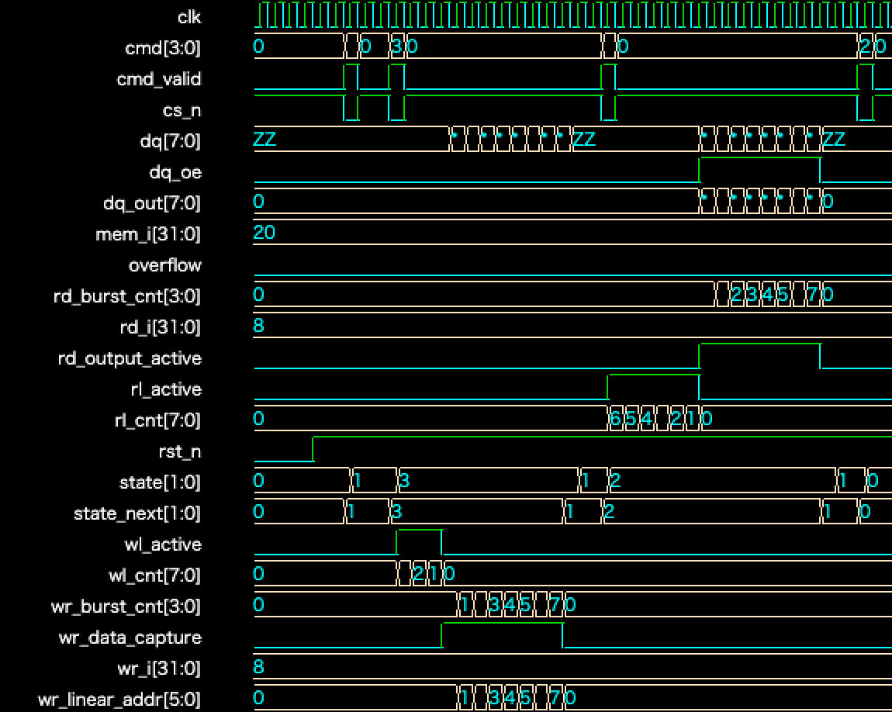

# Simplified DRAM Model in Verilog

## Overview

This project is a simplified DRAM behavioral model developed in Verilog to understand the basic operation of memory devices.

The model supports four basic commands: ACTIVATE (ACT), WRITE, READ, and PRECHARGE (PRE). It uses a 32-entry, 8-bit-wide internal memory and supports burst transfers with a burst length of eight (BL8).

This model was created for educational purposes and does not reproduce all functions or timing requirements of an actual DRAM device.

## Features

* Supports ACT, WRITE, READ, and PRE commands
* 32-entry, 8-bit-wide internal memory
* Burst length of eight (BL8)
* Write latency and read latency control
* Bidirectional 8-bit DQ data bus
* State transitions between IDLE, ACTIVE, WRITE, and READ
* Testbench-based command and timing verification

## Simulation Environment

* EDA Playground
* Icarus Verilog
* EPWave waveform viewer

## File Structure

```text
verilog_study/
├── dram_model.v       # Simplified DRAM model
├── tb_dram_model.v    # Testbench
├── waveform.png       # Simulation waveform
└── README.md          # Project documentation
```

## Test Sequence

The testbench performs the following command sequence:

1. Reset the model
2. Issue an ACT command
3. Write eight data values
4. Read the eight stored data values
5. Issue a PRE command
6. Compare the written and read data

## Debugging and Improvement

During the initial simulation, the last of the eight READ data values was output as zero.

To identify the cause, I displayed the outputs and internal signals of the WRITE-related blocks and compared the write counter, data capture timing, and state transitions clock by clock. This analysis revealed that the control logic judged the WRITE operation to be complete one clock cycle before the final data value was written.

I adjusted the completion condition and the timing relationship between the relevant signals. After the correction, all eight data values were written and read successfully.

Through this debugging process, I learned the importance of analyzing signal relationships across multiple blocks, verifying the entire circuit timing after integration, and narrowing down the cause of a problem based on waveform evidence.

## How to Run

1. Open [EDA Playground](https://www.edaplayground.com/).
2. Select Verilog/SystemVerilog as the language.
3. Select Icarus Verilog as the simulator.
4. Paste `dram_model.v` into the Design window.
5. Paste `tb_dram_model.v` into the Testbench window.
6. Enable the “Open EPWave after run” option.
7. Click “Run” and check the simulation results and waveform.

## Simulation Result

The following waveform shows the ACT, WRITE, READ, and PRE command sequence and the successful transfer of eight data values.


